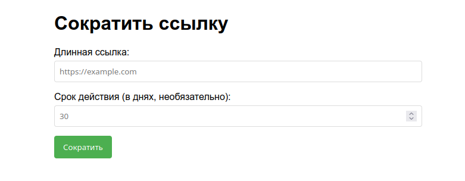
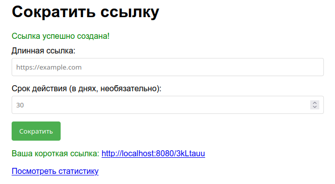

# URL Shortener

A powerful and feature-rich URL shortener service built with Spring Boot. This application allows you to shorten long URLs, track click statistics, and analyze visitor information including geographic data, devices, and browsers.



## Features

- **URL Shortening**: Convert long URLs into short, manageable links
- **Custom Expiration**: Set custom expiration times for shortened links
- **Click Analytics**: Track total clicks and unique visitors
- **Geographic Data**: View visitor locations by country
- **Device Analytics**: See browser, OS, and device information
- **Referrer Tracking**: Identify traffic sources
- **Cleanup Service**: Automatic removal of expired links
- **RESTful API**: Simple API for integration


## Tech Stack

- **Backend**: Java 17, Spring Boot 3.5.5
- **Database**: MySQL
- **Templating**: Thymeleaf
- **Testing**: JUnit, Mockito
- **Build Tool**: Maven
- **Other**: Lombok, User Agent Analysis, IP Geolocation

## Quick Start

### Prerequisites
- Java 17+
- MySQL 5.7+
- Maven 3.6+

### Installation

1. Clone the repository:
```bash
git clone https://github.com/your-username/URLShortener.git
cd URLShortener
```

2. Configure database in `application.yml`:
```yaml
spring:
  datasource:
    url: jdbc:mysql://localhost:3306/url_shortener
    username: your_username
    password: your_password
```

3. Build and run:
```bash
mvn spring-boot:run
```

4. Access the application at `http://localhost:8080`

## Usage

1. Visit the home page and enter a URL to shorten
2. Optionally set a custom expiration time (default: 30 days)
3. Use the generated short URL
4. View statistics by appending `/stats/{code}` to your short URL



## API Endpoints

- `POST /create` - Create a new short URL
- `GET /{code}` - Redirect to original URL
- `GET /stats/{code}` - View analytics for a short URL

## Configuration

Key configuration options in `application.yml`:

- `app.base-url`: Your domain name
- `app.link.length`: Short code length (default: 7)
- `app.link.default-expiration-days`: Default link expiration
- `app.ip-api.enabled`: Enable/disable IP geolocation

## Development

### Running Tests
```bash
mvn test
```

### Building
```bash
mvn clean package
```

## Screenshots

(Please add actual screenshots of:)
1. Main page with URL creation form
2. Statistics page showing analytics charts
3. Error page examples
4. Mobile responsive views

## License

This project is licensed under the MIT License - see the LICENSE file for details.

---

## Contributing

1. Fork the repository
2. Create your feature branch (`git checkout -b feature/amazing-feature`)
3. Commit your changes (`git commit -m 'Add some amazing feature'`)
4. Push to the branch (`git push origin feature/amazing-feature`)
5. Open a Pull Request

## Support

If you have any questions or issues, please open an issue on GitHub.

---

*Note: Replace placeholder images with actual screenshots of your application for a more professional README.*
